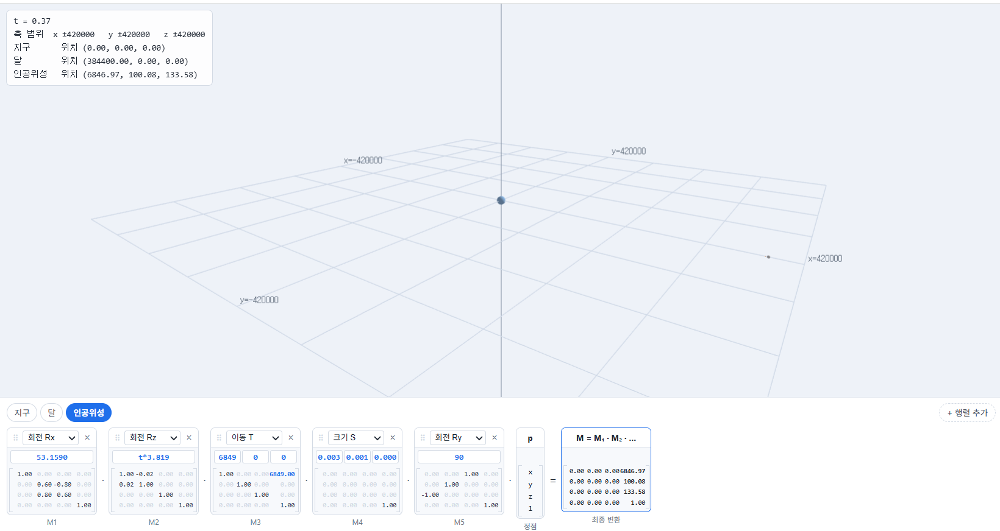
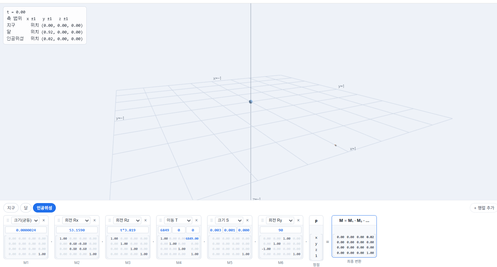
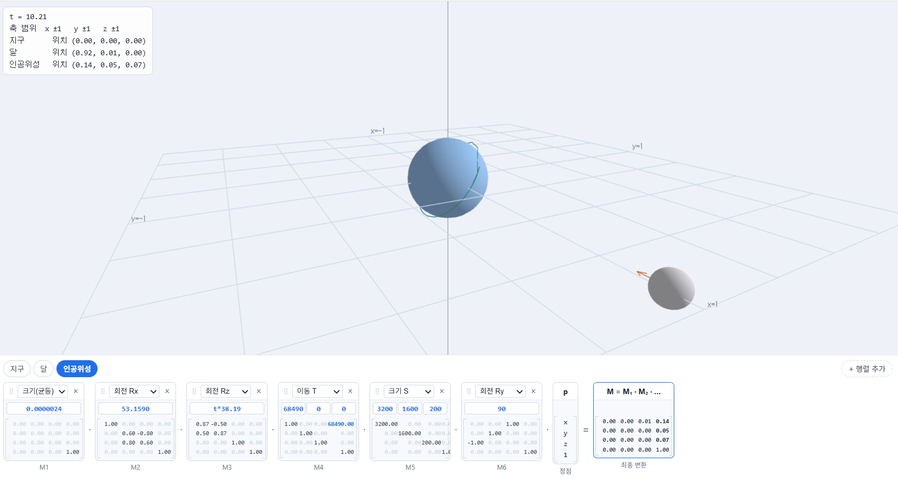

# 2주차 — 지구 · 달 · 인공위성의 변환 설계

- 이름: 윤재현
- 저장소: https://github.com/dbswogus/cg_2026
- 실행: [Task 1](task1.html) · [Task 2](task2.html) · [Task 3](task3.html)

## Task 1 — 실제 비율로 배치하기

### 조사한 값

| 항목        | 값                                                                    | 출처                                                                |
| ----------- | --------------------------------------------------------------------- | ------------------------------------------------------------------- |
| 지구 반지름 | 6371 km                                                               | 위키백과                                                            |
| 달          | 지구와의 거리384400 km 공전 주기가 27.3일                             | 위키백과                                                            |
| 대상 위성   | Starlink-4739, 고도 471km,궤도의 경사각(각도)는 53.1590,공전 주: 94분 | [https://orbit.ing-now.com/satellite/53792/2022-111v/starlink-4739/ |

### 거리의 단위를 무엇으로 정했는가? 왜 그렇게 정했는가?

km로 정하였다. 즉, 지구의 반지름 크기를 6371km로 정해두었다. 지구 반지름이나, 달의 공전 거리, 인공위성의 고도 등 조사한 실제 데이터를 대부분 km 단위로 제공받았기 때문이기도 하고,
m로 정하게 되면, 숫자가 너무 커지고 gpu가 32비트 실수로 계산하기 때문에 유효숫자 7글자를 넘어가서 km로 정한 것도 있다.

### 숫자가 커서 생긴 문제가 있었는가? 있었다면 무엇인가?

천체를 구현하게 되면 매우 큰 천문학적인 숫자들이 나오게 되고, 이 때문에 인공위성의 크기가 상대적으로 너무 작아진다.
그래서 화면상에 제대로 보이지 않는다.

### 달·위성이 지구를 향하게 만든 것은 어느 변환 단계 덕분인가?

달은 Rz(180)을 추가하여 공전 과정에서 로컬 +X 방향이 지구를 향하도록 설정하였다.
인공위성은 궤도면을 기울이기 위해 Rx(53.1590)을 사용하였고, Ry(90)은 위성의 형태가 보기 좋은 방향으로 보이도록 추가하였다.
화살표 표시가 정상적으로 나타나지 않아 Ry(90)이 실제 지구 방향을 유지하는지 시각적으로 확인하기 어려웠다.

### 내가 넣은 변환

**달**

[
{ "type": "Rz", "args": ["0.0091*t"] },
{ "type": "T", "args": ["384400", "0", "0"] },
{ "type": "Su", "args": ["1737"] },
{ "type": "Rz", "args": ["180"] }
]
Rz 180을 넣고 공전을 시켜야 달이 항상 지구를 바라보았다.
달의 반지름이 1737이기에 설정하였다.
달까지의 거리가 384400km이기에 설정하였다.
달의 공전 주기가 27.3일이고, 39312분이다. 360/39312을 하면 0.0091도/분이다. 이를 Rz 0.0091\*t로 표현하였다.

**인공위성**
[
{ "type": "Rx", "args": ["53.1590"] },
{ "type": "Rz", "args": ["t*3.819"] },
{ "type": "T","args": ["6849","0","0"]},
{ "type": "S", "args": ["0.0032","0.0016","0.0002"]},
{ "type": "Ry","args": [ "90"]}
]

버그인것인지 인공위성에는 화살표가 보이지 않아 임의로 보기 좋은 각도로 설정해두었는데, Ry 90도로 설정하였다.
인공위성의 크기가 가로 3.2m 세로 1.6m 두께가 0.2m라는 조사 결과가 있어서 0.0032 0.0016 0.0002로 설정하였다.
고도가 반올림을 하였을 때 6849km에 위치하여 설정하였다. (++6842km가 맞는데 잘못 입력하였다.)
공전 주기가 94 분이므로 360/94 =3.819도/분이고 z축을 기준으로 회전(공전)하므로 Rz(t\*3.829)를 넣으면 된다.
궤도의 경사각이 53.1590이므로 Rx(53.1590)을 하면 된다.

**지구**
[
{ "type": "Su", "args": ["6371"] }
]

지구 반지름의 크기가 6371km이기 때문이다.

- 공유 링크: https://cg.catholic.ac.kr/~mgchoi/CG/demos/d02-transform-lab.html?d=eyJyYW5nZSI6eyJ4IjoiNDIwMDAwIiwieSI6IjQyMDAwMCIsInoiOiI0MjAwMDAifSwib2JqZWN0cyI6W3siaWQiOiJlYXJ0aCIsIm5hbWUiOiLsp4DqtawiLCJjb2xvciI6WzAuMzUsMC42LDAuOTVdLCJzdGVwcyI6W3sidHlwZSI6IlN1IiwiYXJncyI6WyI2MzcxIl19XX0seyJpZCI6Im1vb24iLCJuYW1lIjoi64usIiwiY29sb3IiOlswLjc4LDAuNzgsMC44Ml0sInN0ZXBzIjpbeyJ0eXBlIjoiVCIsImFyZ3MiOlsiMzg0NDAwIiwiMCIsIjAiXX0seyJ0eXBlIjoiUnoiLCJhcmdzIjpbIjE4MCJdfSx7InR5cGUiOiJTdSIsImFyZ3MiOlsiMTczNyJdfV19LHsiaWQiOiJzYXQiLCJuYW1lIjoi7J246rO17JyE7ISxIiwiY29sb3IiOlswLjk1LDAuNzIsMC4zNV0sInN0ZXBzIjpbeyJ0eXBlIjoiUngiLCJhcmdzIjpbIjUzLjE1OTAiXX0seyJ0eXBlIjoiUnoiLCJhcmdzIjpbInQqMy44MTkiXX0seyJ0eXBlIjoiVCIsImFyZ3MiOlsiNjg0OSIsIjAiLCIwIl19LHsidHlwZSI6IlMiLCJhcmdzIjpbIjAuMDAzMiIsIjAuMDAxNiIsIjAuMDAwMiJdfSx7InR5cGUiOiJSeSIsImFyZ3MiOlsiOTAiXX1dfV19

## Task 2 — NDC 범위에 맞추기

### s를 얼마로 정했고 그 값을 어떻게 계산했는가?

달 중심까지 384400 km 이고, 달의 반지름이 1737km 이므로 가장 멀리 있는 곳은 386137 km이다.
이것을 1 안에 넣어야 하므로 1/386137=0.000002589이다.
추가로, 달의 가장자리가 화면 경계에 너무 가까워지는 것을 방지하기 위해 여유를 두어 s=0.0000024로 수정하였다.

### 배율 행렬을 사슬의 맨 앞에 넣은 이유는 무엇인가? 맨 뒤에 넣으면 어떻게 되는가?

행렬은 오른쪽부터 적용되기 때문에 배율 행렬을 맨 앞에 넣으면 기존의 위치와 크기에 배율이 모두 적용된다.
반대로 배율 행렬을 맨 뒤에 넣으면 배율이 먼저 적용된 뒤 T가 적용되므로, 위치 좌표는 축소되지 않고 원래의 큰 값으로 남게 된다.
따라서 달의 위치를 화면 안으로 가져올 수 없다.

### 세 물체에 같은 배율을 쓴 이유는 무엇인가?

세 물체에 같은 배율을 사용해야 지구, 달, 인공위성 사이의 실제 크기와 거리의 비율을 유지할 수 있기 때문이다.
물체마다 다른 배율을 사용하면 화면에 보이기는 편하지만 실제 비율이 달라지게 된다.
따라서 전체 장면을 하나의 비율로 축소하기 위해 세 물체에 같은 배율을 적용하였다.

### 비율을 유지한 결과, 화면에서 지구와 인공위성은 어떻게 보이는가?

실제 비율을 유지하여 크기를 축소했기 때문에 지구는 화면에서 매우 작게 보이고, 인공위성은 지구에 비해 매우 작아서 거의 점처럼 보인다.
특히 인공위성은 실제 크기가 수 m 정도이기 때문에 지구 반지름 6371 km에 비해 매우 작아 육안으로 형태를 확인하기 어렵다.
이를 통해 실제 천체의 크기 비율을 그대로 사용하는 경우 인공위성의 형태를 시각적으로 표현하기 어렵다는 것을 확인할 수 있었다.

### 내가 넣은 변환

**달**

[
{ "type": "Su","args": ["0.0000024"]},
{ "type": "Rz", "args": ["0.0091*t"] },
{ "type": "T", "args": ["384400", "0", "0"] },
{ "type": "Su", "args": ["1737"] },
{ "type": "Rz", "args": ["180"] }
]
task 1에서 비율을 맞추기 위해 추가하였다.

**인공위성**
[
{ "type": "Su","args": ["0.0000024"]},
{ "type": "Rx", "args": ["53.1590"] },
{ "type": "Rz", "args": ["t*3.819"] },
{ "type": "T","args": ["6849","0","0"]},
{ "type": "S", "args": ["0.0032","0.0016","0.0002"]},
{ "type": "Ry","args": [ "90"]}
]
task 1에서 비율을 맞추기 위해 추가하였다.

**지구**
[
{ "type": "Su","args": ["0.0000024"]},
{ "type": "Su", "args": ["6371"] }
]
task 1에서 비율을 맞추기 위해 추가하였다.

- 공유 링크:https://cg.catholic.ac.kr/~mgchoi/CG/demos/d02-transform-lab.html?d=eyJyYW5nZSI6eyJ4IjoiMSIsInkiOiIxIiwieiI6IjEifSwib2JqZWN0cyI6W3siaWQiOiJlYXJ0aCIsIm5hbWUiOiLsp4DqtawiLCJjb2xvciI6WzAuMzUsMC42LDAuOTVdLCJzdGVwcyI6W3sidHlwZSI6IlN1IiwiYXJncyI6WyIwLjAwMDAwMjQiXX0seyJ0eXBlIjoiU3UiLCJhcmdzIjpbIjYzNzEiXX1dfSx7ImlkIjoibW9vbiIsIm5hbWUiOiLri6wiLCJjb2xvciI6WzAuNzgsMC43OCwwLjgyXSwic3RlcHMiOlt7InR5cGUiOiJTdSIsImFyZ3MiOlsiMC4wMDAwMDI0Il19LHsidHlwZSI6IlJ6IiwiYXJncyI6WyIwLjAwOTEqdCJdfSx7InR5cGUiOiJUIiwiYXJncyI6WyIzODQ0MDAiLCIwIiwiMCJdfSx7InR5cGUiOiJTdSIsImFyZ3MiOlsiMTczNyJdfSx7InR5cGUiOiJSeiIsImFyZ3MiOlsiMTgwIl19XX0seyJpZCI6InNhdCIsIm5hbWUiOiLsnbjqs7XsnITshLEiLCJjb2xvciI6WzAuOTUsMC43MiwwLjM1XSwic3RlcHMiOlt7InR5cGUiOiJTdSIsImFyZ3MiOlsiMC4wMDAwMDI0Il19LHsidHlwZSI6IlJ4IiwiYXJncyI6WyI1My4xNTkwIl19LHsidHlwZSI6IlJ6IiwiYXJncyI6WyJ0KjMuODE5Il19LHsidHlwZSI6IlQiLCJhcmdzIjpbIjY4NDkiLCIwIiwiMCJdfSx7InR5cGUiOiJTIiwiYXJncyI6WyIwLjAwMzIiLCIwLjAwMTYiLCIwLjAwMDIiXX0seyJ0eXBlIjoiUnkiLCJhcmdzIjpbIjkwIl19XX1dfQ%3D%3D

## Task 3 — 더 나은 표현 제안

### 실제 비율이 정보를 전달하기에 적합한지 판단하고 그 이유를 쓰세요.

실제 비율은 천체의 실제 크기와 거리를 정확하게 표현한다는 장점이 있지만, 정보를 전달하기에는 적합하지 않다고 판단하였다.
지구와 달에 비해 인공위성의 크기가 매우 작기 때문에 실제 비율을 그대로 적용하면 인공위성이 거의 점으로 보인다.
또한 지구와 달 사이의 거리가 매우 커서 지구와 인공위성을 자세히 관찰하기 어렵다.
따라서 실제 비율은 물리적인 정확성을 보여주기에는 적합하지만, 각 천체의 형태와 움직임을 관찰하기에는 적합하지 않다.

### 더 나은 표현 방법을 하나 이상 제안하고 실제로 만들어 보세요. (예: 크기만 과장하기, 거리를 로그로 압축하기, 축척 막대를 함께 보여 주기 등)

천체의 크기와 공전 속도를 시각적으로 과장하는 방법을 사용하였다.
지구와 달의 크기는 실제 비율보다 10배 크게 설정하고,
인공위성은 실제 크기가 매우 작아 화면에서 형태를 확인하기 어려웠기 때문에 100,000배 확대하였다.
100,000배 확대하더라도 다른 천체에 비해 상대적으로 작게 보였으며, 이를 통해 실제 천체 사이의 크기 차이가 매우 크다는 것을 확인할 수 있었다.
또한 실제 공전 주기를 그대로 사용하면 움직임이 너무 느리기 때문에, 공전 속도는 10배 빠르게 설정하였다.
그럼에도 달의 공전 속도는 느린 것을 볼 수 있긴 하다.

### 제안한 방법의 장점과 잃는 것을 함께 쓰세요.

이 방법의 장점은 각 객체의 형태와 움직임을 확인할 수 있다는 것이다. 특히 실제 비율에서는 전혀 보이지 않던 인공위성을 확인할 수 있다는 것이 가장 좋은 장점이다.

그러나 실제 크기와 비율이 깨진다는 단점이 존재한다. 인공위성의 크기랑 맞지 않으며 이는 물리적인 정확성보다 시각적인 이해와 관찰을 우선한 표현 방법이다.

**달**

[
{ "type": "Su","args": ["0.0000024"]},
{ "type": "Rz", "args": ["0.091*t"] },
{ "type": "T", "args": ["384400", "0", "0"] },
{ "type": "Su", "args": ["17370"] },
{ "type": "Rz", "args": ["180"] }
]
task 2에서 시각적으로 다르게 보이게 하기 위해 크기를 10배, 공전 속도를 10배 해줬다.

**인공위성**
[
{ "type": "Su","args": ["0.0000024"]},
{ "type": "Rx", "args": ["53.1590"] },
{ "type": "Rz", "args": ["t*3.819"] },
{ "type": "T","args": ["68490","0","0"]},
{ "type": "S", "args": ["3200","1600","200"]},
{ "type": "Ry","args": [ "90"]}
]
task 2에서 시각적으로 다르게 보이게 하기 위해 크기를 1000000배, 공전 속도를 10배 해줬다.
추가로 위치도 지구의 크기 증가 비율에 맞게 6849에서 68490으로 옮겨줬다

**지구**
[
{ "type": "Su","args": ["0.0000024"]},
{ "type": "Su", "args": ["63710"] }
]
task 2에서 시각적으로 다르게 보이게 하기 위해 크기를 10배 해줬다.

- 공유 링크: https://cg.catholic.ac.kr/~mgchoi/CG/demos/d02-transform-lab.html?d=eyJyYW5nZSI6eyJ4IjoiMSIsInkiOiIxIiwieiI6IjEifSwib2JqZWN0cyI6W3siaWQiOiJlYXJ0aCIsIm5hbWUiOiLsp4DqtawiLCJjb2xvciI6WzAuMzUsMC42LDAuOTVdLCJzdGVwcyI6W3sidHlwZSI6IlN1IiwiYXJncyI6WyIwLjAwMDAwMjQiXX0seyJ0eXBlIjoiU3UiLCJhcmdzIjpbIjYzNzEwIl19XX0seyJpZCI6Im1vb24iLCJuYW1lIjoi64usIiwiY29sb3IiOlswLjc4LDAuNzgsMC44Ml0sInN0ZXBzIjpbeyJ0eXBlIjoiU3UiLCJhcmdzIjpbIjAuMDAwMDAyNCJdfSx7InR5cGUiOiJSeiIsImFyZ3MiOlsiMC4wOTEqdCJdfSx7InR5cGUiOiJUIiwiYXJncyI6WyIzODQ0MDAiLCIwIiwiMCJdfSx7InR5cGUiOiJTdSIsImFyZ3MiOlsiMTczNzAiXX0seyJ0eXBlIjoiUnoiLCJhcmdzIjpbIjE4MCJdfV19LHsiaWQiOiJzYXQiLCJuYW1lIjoi7J246rO17JyE7ISxIiwiY29sb3IiOlswLjk1LDAuNzIsMC4zNV0sInN0ZXBzIjpbeyJ0eXBlIjoiU3UiLCJhcmdzIjpbIjAuMDAwMDAyNCJdfSx7InR5cGUiOiJSeCIsImFyZ3MiOlsiNTMuMTU5MCJdfSx7InR5cGUiOiJSeiIsImFyZ3MiOlsidCozOC4xOSJdfSx7InR5cGUiOiJUIiwiYXJncyI6WyI2ODQ5MCIsIjAiLCIwIl19LHsidHlwZSI6IlMiLCJhcmdzIjpbIjMyMDAiLCIxNjAwIiwiMjAwIl19LHsidHlwZSI6IlJ5IiwiYXJncyI6WyI5MCJdfV19XX0%3D
